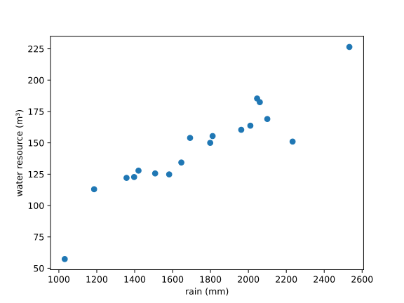
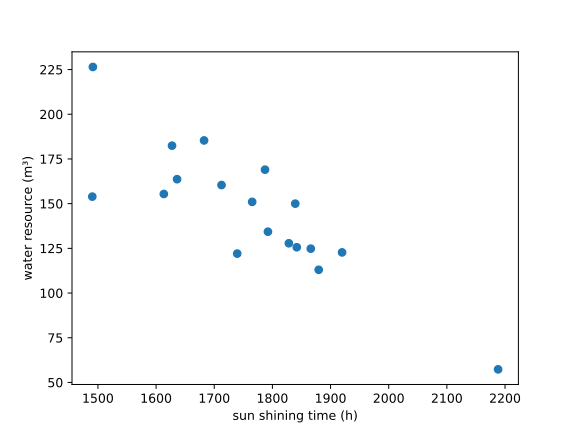
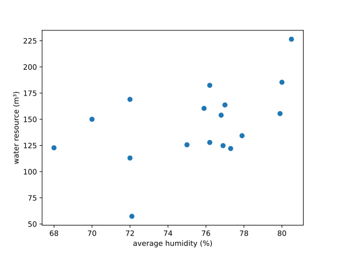
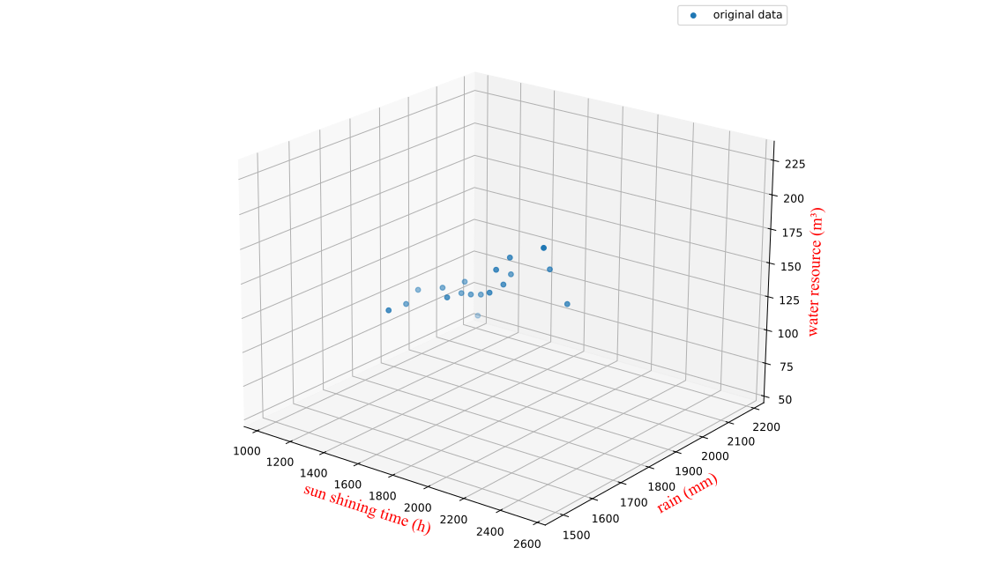
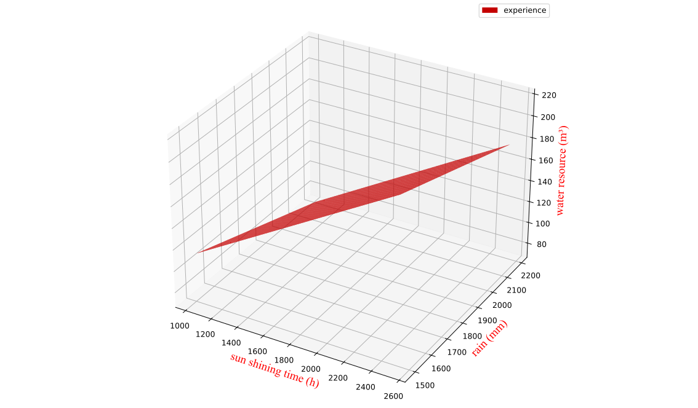
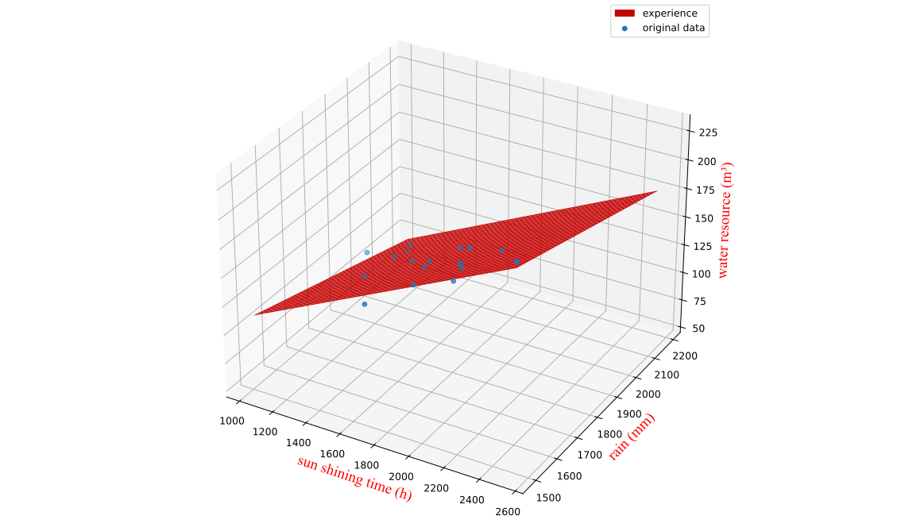

> 参赛选手：陈君逸、黄孜勇、罗梓宁、谢瑜恩、叶彬 
> 指导老师：蔡维、江滢滢、李艾 
> 排名不分先后

## 摘要

水，是生命之源.水资源是维系地球生态系统和人类文明存续的基础性资源.虽然我国面积广阔，从水资源总量来看，是一个比较丰富的国家，但是在世界平均水平中人均占有量确仅有
1/4，被联合国评为“水资源紧缺型”
的国家.而且水资源分配情况呈现出极度不平衡状态.本文针对水资源的影响因素，基于数学分析方法，分别采用多元线性回归模型进行建模分析.水资源主要影响因素分为自然因素与人文因素.但由于人文因素影响复杂且常年稳定，故本建模以对自然因素的研究为主.

首先，我们利用河源市2006~
2023年的历史数据，使用python绘制散点图，以及计算样本相关系数，判断自变量与因变量的相关性.接着基于多元线性回归模型，利用最小二乘法，我们选取了部分变量作为解释变量.对被解释变量即水资源总量进行初步建模，求解回归系数.在考虑变量的合理性（如是否遗漏关键因素）后剔除相关性不大的变量，进一步建模，通过公式计算模型的决定系数
，调整 ,检验模型精确度.结果显示，年降水量、年日照时长与水资源总量基本呈线性关系.

随后我们尝试对模型进行推广，以运用于其他城市.由于不同城市的自然条件、社会经济状况存在显著差异，适用于河源市的模型直接套用，出现了很大的误差，于是尝试添加更多的解释变量如城市面积、城市大型水库蓄水量、城市用水量进行修正，进一步优化后，得到的模型有一定的预测能力，能在一定条件下实现预测功能.

最后，本文对提出的模型进行了全面综合的评价：
该模型在水资源影响因素的研究有一定意义，其反映了自然因素在水资源配置中几乎发挥了决定性的作用；增加修筑城市内部水利工程，加大力度宣扬节约用水，推广节水设施可以在一定程度上优化城市内水资源配置.但在该基础上，仍可以考虑其他非线性模型优化，提高模型精度与适用性.

**关键词:** 水资源；R方检测法；线性回归模型；最小二乘法;python

## 一、自拟题目描述

水，是生命之源.水资源是维系地球生态系统和人类文明存续的基础性资源.然而随着人口增长、经济发展和气候变化影响，水资源短缺与污染问题日益凸显，虽然我国面积广阔，从水资源总量来看，是一个比较丰
富的国家，但是在世界平均水平中人均占有量确仅有1/4，被联合国评为“水资源紧缺型” 的国家[^1]
.而且水资源分配情况呈现出极度不平衡状态，主要表现有：时空分布极不均衡、
供需矛盾日益尖锐、水污染问题突出、利用效率偏低等等.为了优化水资源配置，增强水资源调控能力，请你完成以下数学建模探究：

1. 以河源市为例，运用数学知识，对水资源总量影响因素进行探究并且建立简单的的数学模型，并你所建立的模型进行优化；
2. (1) 中的模型是否能用于其他城市，如不能，应如何改进？

## 二、问题分析

水资源是关乎区域生态安全与社会经济发展的核心资源，我国水资源总量丰富但人均不足、分布失衡的现状，凸显了精准分析水资源影响因素、构建科学调控模型的重要性.整体而言，问题的核心在于从复杂的水资源系统中提炼关键影响因素，建立可量化的关系模型，并通过对模型适应性的分析，形成具有一定推广意义的研究思路.

### 2.1 问题 1 的分析

针对问题（1）的研究

对于城市水资源总量一般情况下往往会有多个因变量对其产生影响，其中包括了自然因素和人文因素.由于人文因素常年波动幅度较小且对水资源总量影响不大，这里我们忽略人文因素，只考虑自然因素，我们选取了年平均气温年降水量，年日照时长年相对湿度作为解释变量.根据所给数据，我们采用图像法以及样本相关系数法[^2]
观察各自变量与因变量的相关性，得到粗略关系，再进一步建立多元线性回归模型[^3]，检验模型预测准度.

### 2.2 问题 2 的分析

针对问题（2）的研究

此问题是在检验模型的适用性，尝试将模型推广到更普适的高度.我们这样先采用已有的模型，输入其他城市的相关数据，并进行检验.此过程中可能会遇到，模型偏差较大的情况.为了简化问题探究过程，我们忽略了城市间在地形，城市布局等各方面的影响因素，尝试添加城市面积、城市主要河流径流、主要水库蓄水面积.作为新的解释变量，进一步优化模型.以期提升其在不同地域的适用性，实现从“个案模型”到“可迁移模型”的转化.

## 三、模型假设

1. 假设题目所给的数据真实可靠；
2. 假设城市间在地形，城市空间布局等除解释变量的因素都可忽略.

## 四、定义与符号说明

网站暂不给出

## 五、模型的建立与求解

数据的预处理：

本研究收集到了河源市、北京市、深圳市、上海市、杭州市 2001 至 2022 年相关数据.主创团队首先对收集到的原始数据进行全面梳理，通过
python matplotlib 可视化方法识别异常值.

河源市 2007 年以前的数据缺失，上海市 2009 年以前的数据缺失，杭州市 2006 年以前的数据缺失，我们选择直接舍弃.

在收集到的数据中，发现河源市某年年降雨量极端异常.于是我们选择删去，并通过其他渠道补充数据.

### 5.1问题1的模型建立与求解

#### 5.1.1 对多元线性回归模型的建立

首先我们先进行数据的相关性检验，确定 2006~2022
年河源市年相对湿度年均气温年降水量年日照的时长与水资源总量较相关的有几项.初步分析时，我们同时采用图像与样本相关系数来比较关联程度.以下是各自变量与因变量的样本相关系数.

|   自变量   |       样本相关系数        |
|:-------:|:-------------------:|
|  年降雨量   | 0.9589002143077459  |
|   年均温   | -0.4907012441700653 |
|  年日照时长  | -0.8500764086782552 |
| 年平均相对湿度 | 0.5083870754427816  |

！[年均温与水资源总量](temp.png)

根据样本相关系数及观察图像，我们注意到年日照时长与年均温呈现一定的负相关关系，而降雨量和年均相对湿度呈现正相关关系，于是我们考虑使用多元线性回归模型拟合数据.

借助python中的scikit-learn模块我们可以得到如下拟合结果（数值计算的代码见附件，论文内展示数据保留三位小数）

| 统计量          | 年降雨量      | 年日照时长  | 年均温   | 年均相对湿度 | 截距      |
|--------------|-----------|--------|-------|--------|---------|
| 回归系数         | 0.071     | -0.078 | 1.372 | -0.808 | 192.517 |
| P值           | 2.487e-06 | 0.014  | 0.819 | 0.403  | 0.114   |
| 决定系数 \(R^2\) | 0.960     |        |       |        |         |
| 调整 \(R^2\)   | 0.946     |        |       |        |         |

得到经验回归方程

\[
\hat{y} = 0.071 x_1 -0.078 x_2 + 1.372 x_3 -0.808 x_4 + 192.517
\]

#### 5.1.2多元线性回归模型的优化

基于对1中模型的结果，我们尝试对其进行优化，优化方向如下：

1. 考虑到问题1我们所建立的模型中，自变量年相对湿度和年平均气温的样本相关系数绝对值较小，相关性较弱，于是我们尝试删去这两个自变量，只保留年降雨量和日照时长.
2. 问题（1）中我们没有对数据进行标准化处理，这次我们尝试标准化.

标准化是数据预处理的常用方法，目的是将不同量级不同单位的数据转换在同一个尺度上,消除量纲差异，使数据更具有可比性.我们使用Z-score
Normalization的方法进行标准化[^3]，转化公式如下

\[
\hat{x} = \frac{x - \mu}{\sigma}
\]

再删除两个相关性较弱的变量，用python拟合得到结果（数值计算的代码见附件，论文内展示数据保留三位小数）
以下是经过计算得出的模型数据，

|     统计量      |   年降雨量    |  年日照时长   |    截距     |
|:------------:|:---------:|:--------:|:---------:|
|     回归系数     |   0.737   |  -0.295  | 4.215e-16 |
|      P值      | 4.769e-07 | 3.511e-3 |   1.000   |
| 决定系数 \(R^2\) |   0.957   |          |           |
|  调整 \(R^2\)  |   0.951   |          |           |

#### 5.1.3 结果

先运用样本相关系数评估了各自变量对因变量的相关性,得出年降雨量和年均气温是城市水资源总量的主要影响因素.

接着采用多元线性回归模型，建立水资源总量与各自变量间的关系.建构模型时使用了2007~2023年的数据，观察到决定系数 和调整
都接近1，可以认为模型较好地反映了自变量与因变量的数量关系.

鉴于城市水资源总量与年降雨量、日照时长关联较大，政府可加强雨水收集与利用，以此提高水资源总量.

### 5.2 问题 2 的模型建立与求解

#### 5.2.1 多元线性回归模型的建立

我们现在需要尝试推广这个模型，将其应用到更多城市中，使其具有普适性.首先我们，将北京市的数据代入原有模型中，发现模型输出值和真实值差异较大.

考虑到不同城市的自然条件、社会经济状况存在显著差异，于是我们尝试进一步考察各城市间的城市的面积，城市大型河流年径流量，城市大型水库蓄水量对水资源总量的影响，添加自变量.自变量
为城市面积， 为城市用水量， 为城市大型水库蓄水量.

借助python中的scikit-learn模块，代入河源市、北京市、杭州市、深圳市、上海市的数据，我们可以得到如下拟合结果（数值计算的代码见附件，论文内展示数据保留三位小数）

|     统计量      |   年降雨量    |  年日照时长   | 城市面积  | 城市大型水库蓄水量 |  城市用水量  |     截距     |
|:------------:|:---------:|:--------:|:-----:|:---------:|:-------:|:----------:|
|     回归系数     |   0.612   |  -0.303  | 0.054 |   0.088   | -0.0388 | -9.021e-17 |
|      P值      | 1.957e-06 | 4.582e-3 | 0.295 |   0.493   |  0.728  |   1.000    |
| 决定系数 \(R^2\) |   0.968   |          |       |           |         |            |
|  调整 \(R^2\)  |   0.963   |          |       |           |         |            |

#### 5.2.2 结果

找到城市面积城市大型蓄水量和城市用水量，三个数据作为新增的自变量，以适应不同城市水资源配置上的差异.接着进行数据标准化，带入线性回归方程求解，得到的模型，观察数据拟合结果发现本次模型的决定系数
和调整 也较接近1，说明本次数据拟合效果较好.对于新添加的变量城市面积\城市大型水库蓄水量和城市用水量的p值较大,说明他们与城市总用水量之间可能并非简单的线性关系，由此造成模型误差增加.

由以上模型我们可以得到城市面积城市大型水库蓄水量与水资源总量成正相关关系，而城市用水量与水资源总量呈负相关关系.观察模型各自变量的回归系数，我们发现城市面积，城市大型水库蓄水量和城市用水量的回归系数都较小，说明他们在对水资源总量的影响上没有前两者明显.但我们并不可否认此三者对水资源总量的影响.三者中城市大型水库蓄水量的回归系数绝对值最大，反映了相关水利工程在水资源保护中的重要意义.而城市面积一定程度上反映了一个城市在自然条件下富集水资源的能力.城市用水量虽然在三者中回归系数绝对值最小，但仍然不容忽视.它在一定程度上与浪费水资源的现象有关，为城市内部合理调配水资源提供数据参考.

综上所述，我们可以得出结论，自然因素在水资源配置中几乎发挥了决定性的作用，这也是造成我国南北水资源差异的主要因素.增加修筑城市内部水利工程，可以有效缓解上述问题.同时政府应该加大力度宣扬节约用水，保护水资源，如设置价梯水价，推广节水设施，鼓励企业采用循环水资源的生产流程，改建农业灌溉技术等等.

## 六、模型的评价及优化

### 6.1 误差分析

#### 6.1.1 针对问题1的误差分析

模型1在使用python拟合模型的时候并未进行标准化除去量纲带来的影响，并且我们发现年均温与年均相对湿度的样本相关系数的绝对值偏小，P值偏大，我们考虑删除这两个自变量以优化该模型.
删除两个自变量之后，模型的精度得到了显著的提高.两个自变量的p值极小，最后的决定系数r方和调整r方较接近1.但仍有误差，我们猜测这些误差可能来自于没有将人文因素考虑进去.

#### 6.1.2 针对问题2的误差分析

本次建模的误差主要来自于各城市间自然条件，社会经济状况差异较大，同时我们只选取了5个城市，得到的模型不能完全反映所有城市的共同特点.同时数据中出现的缺失，主创团队选择了直接舍弃，也是可能存在的误差原因.或许可以采用一些数学方法估计缺失值，从而保留了该年份的其他有效数值.

其次，我们使用了软件帮助我们计算，精度误差不可避免地就会产生.

再者，误差也极有可能是多元线性回归模型本身的局限性造成的，相关人文因素可能与因变量间并非呈简单的线性关系,可以考虑后续添加交互项来进一步拟合.

### 6.2 模型的优点（建模方法创新、求解特色等）

灵活运用了高中所学的多元线性回归模型，适当的建立假设简化模型的分析和计算，同时在数据分析中迅速找到关键因素，建构出来的模型预测精度较高.后续能考虑到模型的普适性，并通过增加自变量对其进行进一步的推广，一定程度上扩大了模型的适用范围，使模型本身对于水资源调配更具有现实意义.

### 6.3 模型的缺点

本模型到优化后期就受到了数据量的制约影响，限制了模型的精度.模型的预测结果也受一些不可控的因素的影响，存在不确定性.同时多元线性回归模型本身由于忽略自变量问的纠缠，或自变量与因变量非线性关系，也不能完美地反映各自变量与因变量之间的数量关系.

### 6.4 模型的推广

本模型运用到了高中所学的知识，能够有效地预测结果.若要对其推广和优化，我们可以考虑的方向有：

1. 增加数据的输入量，使预测模型精度更高更可信；
2. 引入更多影响因素如城市地形条件、城市植被覆盖率、城市水文条件等等，以更详细地量化自变量与因变量数量关系.
3. 对部分数据进行滞后处理，如使用上一年用水量，避免双向因果干扰.
4. 考虑更加先进更加复杂的模型（如系统动力学）进行建模.

---

## 参考文献

[^1] [360 百科](<http://baike.so.com/doc/4958951-5180921.html>).
[^2] 高中数学选择性必修三
[^3] 刘来福、徐晓阳、陈雄.高中数学建模[M].北京西城区新街口外大街12-3号.北京师范大学出版社.
