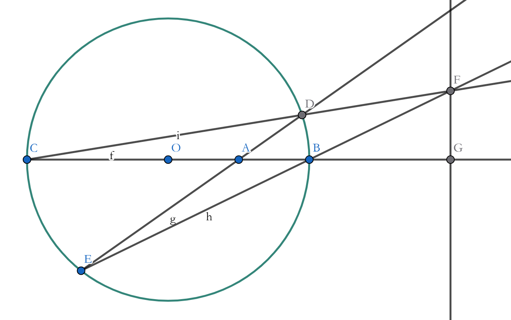

## 试题部分

> 注意事项:
>
> 1. 全卷共 16 小题, 满分 120+30 分, 考试时长 90 分钟.
> 2. 答题前, 考生务必将自己的姓名、班级等信息填写在答题卡的相应位置.
> 3. 考生请在答题卡上作答, 在试卷上作答无效.
> 4. 选择题请使用 2B 铅笔填涂, 非选择题使用0.5mm 黑色签字笔作答.
> 5. 考试结束后, 上交答题卡.

### 一、填空题（共8题, 64分）

1. 已知集合 $M = \{ u | u = 12m + 8n + 4l, m, n, l \in \mathbb{Z}\}$, $N = \{ v | v = 20p + 16q + 12r, p, q, r \in \mathbb{Z}\}$, 则 $M$ 与 $N$ 的关系是______
2. 函数迭代, 就是一个函数与自身复合多次, 将 $f(x)$ 迭代 $n$ 次记作 $f^{(n)}(x), n \in \mathbb{N^*}$. 一般地, 有 $f^{(0)}(x) = x, f^{(1)}(x) = f(f^{(0)}(x)) = f(x),f^{(2)}(x) = f(f^{(1)}(x)) = f(f(x)), f^{(3)}(x) = f(f^{(2)}(x)), \cdots ,f^{(n)}(x) = f(f^{(n-1)}(x))$. 已知 $f(x) = \frac{1+\sqrt{3}x}{\sqrt{3}-x}$, 则 $f^{(2023)}(2023) = $ ______
3. 已知 $f(x) = x^4 + bx^3 + cx^2 + dx + a$, 且 $f(1) = 5, f(2) = 10, f(3) = 15$, 则 $f(8) + f(-4) = $ ______
4. 已知 $a + b +c = m, m > 0, m \neq 1, a, b, c > 0$, 则 $\frac{a}{b+2c}+\frac{2c}{a+b}+\frac{b}{a+2c}$ 的取值范围是 ______
5. 若 $x^{x^3} = 3$, 则 $x^9 = $ ______
6. $x^{2026} = e^x$ 的两个绝对值不大于二的实数根为 $\alpha, \beta, |\alpha+\beta|=a \cdot 10^{-b}, b \in \mathbb{N^*}$, 且 $|\lg a - 1|$ 最小, 则 $b =$ ______
7. 甲、乙两人各有四张卡片, 每张卡片标有一个数字, 甲的卡片上分别标有数字 1, 3, 5, 7, 乙的卡片上分别标有数字 2, 4, 6, 8. 两人进行四轮比赛, 每轮比赛中两人各自从自己的卡片中随机选择一张, 并进行比较, 数字大者得1分, 数字小者不得分, 然后扔掉此轮所选卡片, 则四轮比赛结束后, 甲的得分小于 2 概率为 ______
8. 已知 $xy = 6, x, y > 0$, 则 $x + y + \sqrt{(x-2)^2 + (y-3)^2}$ 的最小值为 ______

### 二、解答题（共3题, 56分）

#### 9. (16分， 10+6)

1. 如图 1, 圆 $O$ 的一条半径 $OB = 1$, $A, D$ 在射线 $OB$ 上, 且 $OA = \sqrt{2}-1$, $E$ 是圆上一动点, 连接 $AE$ 并延长交圆 $O$ 于点 $F$, 连接 $DF$ 并延长交圆 $O$ 于点 $C$. 求证: $OD = \sqrt{2}-1$ 是 $CE \perp AD$ 的充要条件.
2. 如图 2, $BC$ 是圆 $O$ 的一条直径, $A$ 在线段 $OB$ 上, $OA = a, OB = r$, 过点 $A$ 作直线交圆 $O$ 于 $D, E$, 直线 $CD, BE$ 交于点 $F$, 过 $F$ 作 $FG \perp BC$ 于点 $G$. 问: $BG$ 是否为定值? 若是, 求出该定值(用 $a, r$ 表示); 若不是, 说明理由.

#### 10. (20分, 4+8+8)

已知 $x^2 - 4xy + 8y^2 = 8, x, y \in \mathbb{R}$.

1. 求 $xy$ 的最大值.
2. 分别求 $x, y$ 的取值范围, 并求当 $|x|$ 最大时 $|x+y|$ 的值.
3. 当 $x < 0, y > 0$ 时, $x, y$ 之间存在函数关系 $y = f(x)$. 证明或证伪: $f(x)$ 单调.

#### 11. (20分, 4+7+9)

若函数 $f(x)$ 满足: 对于任意的正数$s, t$, 都有 $f(s), f(t) > 0$, 且 $f(s) + f(t) < f(s + t)$, 则称 $f(x)$ 为“L 函数”.

1. 试判断 $h(x) = x^3 + x$ 是不是 “L 函数”, 说明理由.
2. 若函数 $g(x) = a(e^x - 1) + (e^x + 1)$ 是“L 函数”，求实数 $a$ 的取值范围.
3. 若函数 $f(x)$ 是“L 函数”, 且 $f(x) = 2$. 求证: $\forall x \in (1, +\infty), f(x) > 2(x-1)$.

### 三、附加单选题（共 5 题, 30分）

<!--markdownlint-disable MD029-->

12. 在平面直角坐标系中, 设 $\triangle ABC$ 的顶点分别为 $A(0, a), B(b, 0), C(c, 0)$, 点 $P(0, p)$ 在线段 $OA$ 上且异于端点, 设 $abcp \neq 0$, 直线 $BP$ 与 $AC$ 相交于 $E$, $CP$ 交 $AB$ 于 $F$, 已知直线 $OE: (\frac{1}{b}-\frac{1}{c})x+(\frac{1}{p}-\frac{1}{a})y=0$, 则 $OF$ 的表达式为 ______

- A. $(\frac{1}{c}-\frac{1}{b})x+(\frac{1}{p}-\frac{1}{a})y=0$
- B. $(\frac{1}{b}-\frac{1}{a})x+(\frac{1}{p}-\frac{1}{c})y=0$
- C. $(b-c)x+(p-a)y=0$
- D. 以上说法均错误

13. 从 $1, 2, 3, \cdots, 10$ 中选出三个不同的数, 使得这三个数中任意两数之和都是合数, 则不同的选法共有 ______

- A. 20
- B. 25
- C. 30
- D. 35

14. 设 $n \in \mathbb{N^*}$, 且 $n^2 + 19 n + 13$ 为完全平方数. 这样的 $n$ 的个数有 ______

- A. 0
- B. 1
- C. 2
- D. 无穷多

15. 把一个集合 $M$ 分成 $n$ 个非空子集: $A_1, A_2, A_3, \cdots, A_n$, 如果: (1) $A_i \cap A_j = \emptyset, 1 \le i, j \le n, i \neq j$; (2) $A_1 \cup A_2 \cup A_3 \cup \cdots \cup A_n = M$, 那么这些子集的全体叫做集合 $M$ 的一个 $n$-分划. 现有由正整数组成的集合 $C$, 满足如下条件: 删除其中的任意一个元素后形成的集合 $C_0$ 存在一个 2-分划, 使得每个子集内的元素之和相等. 则集合 $C$ 中至少有多少个元素?

- A. 5
- B. 7
- C. 8
- D. 10

16. 若 $a = \lg 2 \times \lg 5, b = \frac{\ln 2}{2}, c = \frac{\ln 3}{3}$, 则

- A. $a > c > b$
- B. $b > c > a$
- C. $a > b > c$
- D. $c > b > a$

## 参考答案

### 一、填空题

1. $M = N$
2. $f^{(2023)}(2023) = \frac{1 + \sqrt{3} \cdot 2023}{\sqrt{3} - 2023}$
3. 2540
4. $[\frac{3}{2}, +\infty)$
5. 27
6. 4
7. $\frac{1}{2}$
8. $5-2\sqrt{3}$

### 二、解答题

#### 9

暂不提供

#### 10

【解】: (1)

$ 8 = x^2 - 4xy + 8y^2 \ge 2 \cdot x \cdot 2 \sqrt{2}y - 4xy = 4(\sqrt{2} - 1)xy $

$\therefore xy \le 2 + \sqrt{2}$

当且仅当 $x = 2\sqrt{2}y$, 即

$x = \sqrt{8+4\sqrt{2}}, y = \sqrt{1+\frac{\sqrt{2}}{2}}$

时取等.

(2) 配方得

$(x - 2y)^2 + 4y^2 = 8$

$\therefore 8 = (x - 2y)^2 + 4y^2 \ge \frac{1}{2}x^2 \Rightarrow x^2 \le 16$

$\therefore x$ 的范围是 $[-4, 4]$

又 $x^2-4xy+8y^2-8=0$,

把它看作关于 $x$ 的一元二次方程, 则该方程有解,

$\therefore \Delta = (4y)^2 - 4 \cdot 1 \cdot (8y^2 - 8)  = 16(2-y^2) \ge 0$

$\therefore y$ 的范围是 $[-\sqrt{2}, \sqrt{2}]$.

当 $|x|$ 取最大值 4 时, 令 $x = 4 \Rightarrow y = 1, x = -4 \Rightarrow y = -1$,

$\therefore |x+y|=5$

(3) $\forall -4 \le x_1 < x_2 < 0$ 且 $y_1 = f(x_1) > 0, y_2 = f(x_2) > 0$,

则

$\begin{matrix}
x_1^2 - 4x_1y_1 + 8y_1^2 = 8 \\
x_2^2 - 4x_2y_2 + 8y_2^2 = 8
\end{matrix}$

两式相减得

$(x_1^2 - x_2^2) - 4(x_1y_1 - x_2y_2) + 8(y_1 - y_2)(y_1 + y_2) = 0$

$\because x_1 < x_2 < 0 \Rightarrow (x_1 - x_2)(x_1 + x_2) > 0$,

$\therefore 2(y_1 - y_2)(y_1 + y_2) < x_1y_1 - x_2y_2 < x_2(y_1 - y_2)$

$\therefore (y_1 - y_2)(2y_1 + 2y_2 - x_2) < 0$

$\because y_1 > 0, y_2 > 0, x_2 < 0 \Rightarrow 2y_1 + 2y_2 - x_2 > 0$

$\therefore y_1 < y_2, f(x_1) < f(x_2)$

$\therefore f(x)$ 单调递增.

#### 11

暂不提供

### 三、附加单选题

暂不提供
